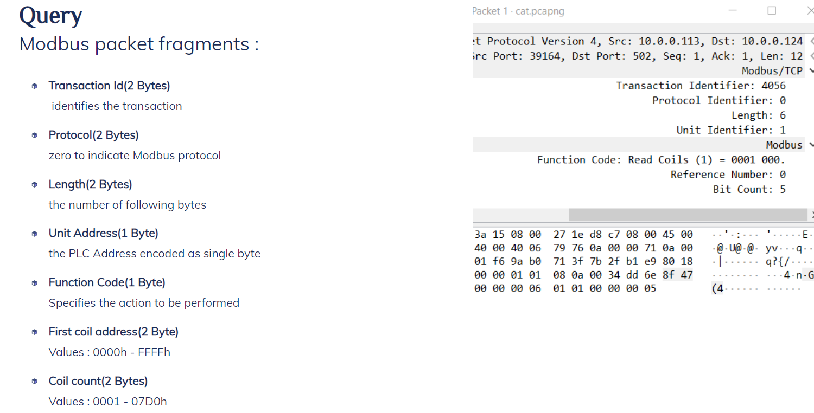

  
  <h1>👨‍💻 Modbus Protocol Data Injection Project 💻</h1>
  
Exploiting Modbus protocol vulnerabilities with a focus on data integrity and ethical principles

---

## Table of Contents

- [Introduction](#introduction)
- [Project Overview](#project-overview)
- [Modbus Protocol](#modbus-protocol)
- [Injection Techniques](#injection-techniques)
- [Project Objectives](#project-objectives)
- [System architecture](#system-architecture)
- [Getting Started](#getting-started)
- [Usage](#usage)
  - [Investigating the Protocol](#investigating-the-protocol)
  - [Demonstration Video](#demonstration-video)
- [License](#license)

## Introduction

This README provides an overview of the Modbus Protocol Data Exfiltration Project. The project focuses on successfully injecting information to a demo critical facility while avoiding suspicion and notifications in the Human-Machine Interface (HMI).

## Project Overview

- Modbus TCP is a widely used communication protocol in industrial automation and control systems, facilitating seamless data exchange over Ethernet networks.
- The project explores the Modbus communication protocol, which involves query/response (master/slave) and broadcast methods.
- Injection techniques are employed to manipulate Modbus packets while maintaining data integrity and avoiding errors.

##  System architecture
| System architecture |
| :---: |
|  |

## Modbus Protocol

- Modbus communication involves query/response frames, comprising recipient addresses, commands, and data.
- The master-slave technique is used, with the master initiating queries and slaves responding.
- Slaves are external devices processing and sending data to the master.

## Injection Techniques

### "Rocks otorio" (50 times)

- This task involves modifying Modbus packets to inject data while avoiding errors.
- Adjustments are made to the fields' length and byte count to align with updated data.

### Leaking a Cat Picture

- This task involves modifying packets to inject an image.
- The image is segmented into portions matching the protocol's prescribed length and byte count fields.
- Fields' length and byte count are precisely adjusted to match the updated data.
- Smart fragmentation techniques are employed for image injection.

## Project Objectives

The primary objectives of this project include:
- Demonstrating successful data injection to a critical facility.
- Evading suspicion and alerts in the Human-Machine Interface (HMI).
- Maintaining data integrity while skillfully manipulating Modbus packets.

## Getting Started

Before getting started, please ensure that you have met the following prerequisites:

- Otorio has generously provided all the necessary virtual machines for the Human-Machine Interface (HMI) and Programmable Logic Controller (PLC). Additionally, the view has been configured on the Supervisory Control and Data Acquisition (SCADA) system.
- It's essential to acknowledge that all rights and privileges related to these resources are reserved for the Otorio company.

## Usage

[Link for the project's presentation](https://app.decktopus.com/share/Xh21z3rhc/s/1)

### Investigating the Protocol
| Modbus query packet fragments |
| :---: |
|  |

| Modbus response packet fragments |
| :---: |
|  |

### Demonstration Video

Watch the project in action by viewing our [demonstration video](https://clipchamp.com/watch/Q5udOQY7X2p).

## License

All rights and privileges related to these resources are reserved for the Otorio company.
